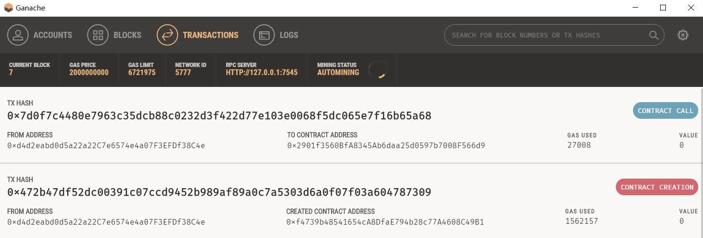
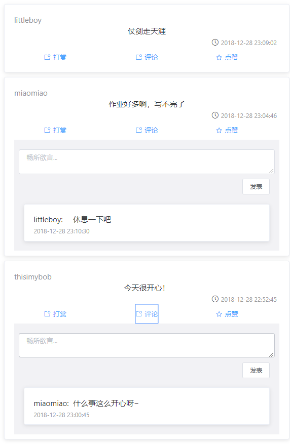

Github 地址：https://github.com/Yuuoniy/Dapp-link.git

<!-- @import "[TOC]" {cmd="toc" depthFrom=1 depthTo=6 orderedList=false} -->

<!-- code_chunk_output -->

* [简介](#简介)
	* [选题背景](#选题背景)
	* [实现](#实现)
	* [项目结构](#项目结构)
	* [环境](#环境)
	* [运行](#运行)
	* [使用说明](#使用说明)
		* [注册用户](#注册用户)
		* [发表动态](#发表动态)
		* [打赏用户](#打赏用户)
		* [评论动态](#评论动态)
		* [修改个人信息](#修改个人信息)
		* [查看用户](#查看用户)
	* [测试](#测试)
		* [注册](#注册)
		* [发表动态](#发表动态-1)
		* [评论动态](#评论动态-1)
		* [评论显示](#评论显示)
		* [评论收起](#评论收起)
		* [查看个人信息](#查看个人信息)
		* [查看用户](#查看用户-1)
		* [打赏动态](#打赏动态)
	* [遇到的问题](#遇到的问题)

<!-- /code_chunk_output -->

# 简介
基于以太坊区块链简单的去中心化社交网络，名字为link。
去中心化的社交网络打破现有社交网络的规则。在该分布式网络上，把用户资料和信息的控制权归还给个人，并为有贡献的用户提供激励。用户发布的信息都是通过加密的，并且记录在一个公链上。没有人可以篡改。
该网络具有以下几个特点：
1. **去中心化的网络结构**
  社交网络巨头的中心化程度越来越高，具有许多严重的问题。而去中心化社交网络从技术上是一个分布式账本，所有的记录都不可篡改，用户通过分布式网络来掌控个人的信息和内容。这将在真正意义上实现用户的言论自由，重新建立人与人之间的信用体系。
2. **保证了个人数据安全**
  用户信息以加密形式存储在网络节点上，形成一个分布云。平台没有中央服务器或数据中心，按照区块链技术，数据是冗余存储，数据只有掌握了秘钥的人才能查看。保证了个人的数据安全。
3. **服务器不会向用户推送商业广告**
## 选题背景
 据有关数据统计，`2012—2017`年全球总人口规模及使用网络人口比例呈稳步上升状态，`2017`年世界总人口达`75`亿，其中使用网络的人口占比达`48％`，根据预测，`2019`年全球互联网普及率将超过`50%`，届时全球将有`38.2`亿网民，占总人口`50.6%`。互联网渗透率的提升为人们使用社交软件提供条件，满足人与人之间长期的情感表达需求。
  人们离不开社交网络。而社交网络也在影响着我们生活。但是中心化网络存在严重的问题。
  1. **权力集中**
  而目前的许多社交网络应用的权力集中在少数人手中。他们决定大众接收到的内容。控制在网络上流传的内容，并且会对不符合他们利益的信息进行隐藏或者删除。少数人决定谁能在特定社交平台上掌握更多的话语权。这些人借助这种力量追求个人的利益。
  2. **信息泄露**
  个人信息集中在数据中心，存在信息泄露的问题，比如 `facebook` 之前的信息泄露事件。
  3. **商业广告推送**
  `Facebook` 和 `Twitter` 这些社交网络使用他们所掌握的个人数据，通过分析用户偏好来推送广告，用户日常被“量身定做”的广告推送所影响。
去中心化的社交平台，能够解决现如今中心化社交平台所存在的问题。

**效果图**：


## 实现
- 后台使用 `truffle` 框架进行开发，前端使用 `vue` 框架。通过 `web3.js` 进行通信。
- 程序功能：注册账户、发表动态、评论动态、打赏、查看个人信息、查看用户等

## 项目结构
```
├─build
│  └─contracts  //合约编译结果
├─contracts //智能合约
├─front-end  //前端代码
│  ├─build
│  ├─config
│  ├─src 
│  │  ├─components  //vue 组件
│  │  ├─libs //自定义的库文件 
│  │  └─views  //显示的页面
│  └─static 
├─migrations //存放部署文件
├─ test //合约的测试文件
└─ truffle.js //配置文件目录

```

## 环境
```
windows 10 
Truffle v4.1.14 (core: 4.1.14)
Solidity v0.4.24 (solc-js)
node v8.4.0
npm 6.5.0
vue 2.8.2
```
## 运行

首先需要运行自己的私链，部署合约，之后运行前端部分，即可调用智能合约。

1. 运行 `ganache`


2. `truffle console --network ganache` 进入控制台  
注：如果要运行 `testrpc` 或其他私链，请在 `truffle.js` 进行配置，启动的时候 `truffle console -network` 你的私链名称  
3. 在控制台输入 `migrate --reset -complie-all`  
编译并部署合约到私链上：

在 `ganache` 中也可以查看到部署的合约

 

4. 进入 `front-end` 目录，
- `npm install` 安装依赖
- `npm run dev` 运行

等构建结束后，便可在浏览器访问  `http://localhost:8080`


使用 `MetaMask` 连接到我们的私链上，可以通过密钥导入相关用户。
|   |   |
|---|---|
|   |   |

## 使用说明

因为每个地址绑定一个用户，程序直接检测 `web3` 当前的账户，如果需要切换账户，则 MetaMask 切换即可，程序会自动检测并且从区块链中获取对应的数据，交易时需要配合 `MetaMask` 使用。
对于每一个操作，网页回在顶部弹出提示信息，说明失败或成功。
### 注册用户
程序自动检测当前用户是否注册，如果未注册，则会跳转到注册界面，注册完成后跳转到主页。如果已经注册过，则自动进去主页。
程序对输入信息进行了校验，不合法会注册失败。
### 发表动态
输入动态，点击发表，在 `MetaMask` 中点击确认即可，若要取消，则点击 `REJECT`，发表成功或失败会有对应的弹框。发表后，页面会获取最新的动态。动态按照发表进行显示，最新发表的动态会显示在最前面。符合人们的需求。

### 打赏用户
在对应的动态下点击打赏，可以查看到要打赏的用户及其地址，以及自己当前的余额，输入打赏金额进行打赏，单位为 `ETH`
### 评论动态
在对应的评论下点击评论，输入评论内容，发表后即可看到最新的评论。
### 修改个人信息
点击修改个人信息即可修改
### 查看用户
查看用户列表，可以查看系统当前注册的用户的部分信息：用户名、个性签名、状态数及邮箱。

## 测试
### 注册
| 合法性检测  | 在MetaMask确认注册  |
|---|---|
|   |   |

成功注册  
 

### 发表动态 
 

 发表成功，即可在首页看到：  


### 评论动态
点击评论，显示评论框，输入评论内容进行评论。
 
成功评论：  
 

### 评论显示
每个动态正确显示对应的评论，并且没有点击评论的动态，会收起评论框。每条动态按发表时间显示，最近的靠前。

 

### 评论收起
 

### 查看个人信息
 
结果正确，在 `MetaMask` 中切换登录账户，此时个人信息也成功显示对应用户的：

 

### 查看用户
 

### 打赏动态
 
 点击打赏，弹出信息框

 
正确显示作者名称、地址、账户余额，输入金额，测试时输入10，点击确定，可以看到转账确认信息：

| 转账确认  |  成功转账 |
|---|---|
|    |    |

在 ganache 中也能看到对应的交易

 

测试过程中，弹框显示正确：

 
 
 

测试结果均正确，不过有时候网络有问题，`MetaMask` 连接的时候比较卡。从区块链中获取信息的时候也有延时。
## 遇到的问题
1. 点击相应动态的评论按钮，显示相应的评论。
一开始的思路是使用数组保存每条动态评论显示的状态，用户按钮通过点击，改变状态，从而显示/隐藏相应的评论。但是在实现中发现，用户点击的时候，控制台输出的值确认已经改变，但是页面没有渲染。而使用 `chrome` 的 `vue` 调试插件，发现状态并没有改变。通过搜索得知，这是 `vue` 数组更新检测的问题。
官方文档说了：
```
由于 JavaScript 的限制，Vue 不能检测以下变动的数组：
当你利用索引直接设置一个项时，例如：vm.items[indexOfItem] = newValue
当你修改数组的长度时，例如：vm.items.length = newLength
```
可以使用
```
vm.$set(vm.items, indexOfItem, newValue)
```
因此使用 set 进行数组元素的更新，解决问题。

2. `MetaMask` 的使用
- 注意 `MetaMask` 连接的网络要连到对应私链的网络，否则会导致 js 代码中通过 `web3` 获取 `networkId` 出现错误。获取的是其他链的 `network Id`
- `MetaMask` 时常会一直停在 `connecting to unknow network`
解决方法：如果右上角有转轮，点击转轮切换网络。如果没有，重启拓展。测试的时候经常遇到...

3. 调用合约的返回值为交易哈希值，不是自己在函数中返回的值： 
查阅资料得知：
合约中的这些带有返回值的函数，有一部分是纯读取操作，这样的函数返回值是可以通过 `web3` 返回的，但是有交易（修改、写操作）的函数 `web3` 是不会按预期返回值的，而是返回这次交易的哈希值。
可以通过 `event` 操作传输值，获取查阅对应的交易获取数据。

4. 使用 `vue` 的 `mixins`，发现不能正常渲染，提示变量未定义
查阅得知：
由于 `Vue` 不允许动态添加根级别的响应属性，因此必须通过预先声明所有根级别的响应数据属性来初始化 `Vue` 实例，即使是空值 , 因此在 `data` 中添加必要的变量

5. 合约转账
本来是很基础的东西.. 但是感觉自己折腾了好久.. 
一开始给每个用户定义了一个 `balance` 变量，转账：
```js
 for (uint j = 0; j < users.length; j++) {
      if(users[j].addr==receiver){
        users[i].balance -= amount;
        users[j].balance += amount;
        emit  CoinTransfer(msg.sender, receiver, amount);
        return true;
      }
    }
```
通过查阅后发现，转账应该使用自带的 `transfer` 函数，通过 `address.balance` 获取余额。
可以编写了函数：
```js
  function sendCoin(address receiver) public payable returns(bool sufficient){
    receiver.transfer(msg.value);
    return true;
  }
```
但是我通过 `web3` 调用合约中编写的转账函数时，发现没法正常调用，因为前端传的是字符串，而合约中函数接收的参数是 address 类型的。搜索 `web3 string to address`, 并没有找到满意的解法。
后来发现直接使用 `eth.sendTransaction `就好了指明` to,from,value` 就好了

6. 相关的异步操作
程序编写中还有很多异步的坑，比如检查网络连接、调用智能合约函数、必要的时候要设置 `setInterval`。否则.. 会一直无法从链上获取数据。

7. vue 中全局变量的保存与修改
使用 `vuex`

8. 分页实时渲染
原本使用了 `paginate` 进行分页，但是发现发表动态的时候，不能在页面实时更新，只有手动更新才会显示新动态，去掉 `paginate` 后可以实时渲染，而且更新的时候是通过 `push` 的，所以不存在使用下标更新数组元素导致不能实时渲染的问题。因此最后使用了 `forceUpdate`

9. `solidty` 数组返回的 `length`
测试发现发表动态后，获取动态数返回的 length 仍然是原先的动态数。 因此总是不能显示最新发表的动态，遍历的是 `[0,length-1] `，但是刷新页面后又能显示最新的动态。此时 `length` 的返回值也对了。后来尝试，遍历下标从 `[0，length]` 。解决了问题。
但还是觉得比较奇怪..  如果说 `length` 返回错误的话，刷新后就对了呀？如果返回的是对的话，发表动态后获取的 `length` 是错的呀，如果是数据还没即时存到数组，但是前端是可以获取到新添加的对象呀。. 这是因为数组的 `length` 没来得及更新吗。. 或者是异步的原因？网上没有查到相关的资料。

10. 智能合约的编写问题
感觉智能合约编写也是要很大的技巧的。. 有些想法看起来很简单，但是在实现方面就很麻烦，熟练使用 `mapping+length` 吧，避免使用嵌套结构。


最后一点感想: 一开始觉得智能合约好麻烦，比如返回值限制很多，搜索查询除了遍历好像也没别的方法、嵌套结构麻烦... 主要还是不熟吧，写着写着感觉和其他的项目也差不多...（差不多花很多时间调布局) 用 solidty 写好接口就行了，就是测试的时候 `MetaMask` 经常卡很久比较烦躁。本次项目功能比较有限，还有很多需要完善的地方，比如头像、点赞、关注用户等等。以后有空会继续做。总的来说，感觉很不错啦！踩了很多坑也学到很多。
