# 前期热身报告
[toc]
## 以太坊的安装、私有链创世区块搭建、私有链节点的加入
### 安装
从 `geth` 官网下载 `windows` 下的安装程序，进行安装
版本 `Geth 1.8.17 `
在命令行启动 `geth` 
### 私有链搭建
依次执行命令：
`mkdir private-geth `  
`cd private-geth `   
编写genesis.json 
```json
{
  "config": {
    "chainId": 12345,
    "homesteadBlock": 0,
    "eip155Block": 0,
    "eip158Block": 0
  },
  "coinbase": "0x0000000000000000000000000000000000000000",
  "difficulty": "0x1",
  "extraData": "0x123456",
  "gasLimit": "0xffffffff",
  "nonce": "0x0000000000000042",
  "mixhash": "0x0000000000000000000000000000000000000000000000000000000000000000",
  "parentHash": "0x0000000000000000000000000000000000000000000000000000000000000000",
  "timestamp": "0x00",
  "alloc": {}
}
```
初始创始块   
`geth --datadir ./data/00 init genesis.json`   
打开控制台
`geth --datadir ./data/00 --networkid 15 console`     
创建新账户
`personal.newAccount()`    
解锁
`personal.unlockAccount(eth.accounts[0])`   
`miner.start()`   
挖矿一段时间后：   
停止挖矿 `miner.stop()`   
查看 区块总数 `eth.blockNumber `   
查看账户余额   
```c
> eth.getBalance(eth.accounts[0])
190000000000000000000
>
```
创建一个新的账户，账户0向账户1 转账
```c
> eth.getBalance(eth.accounts[1])                                        
0                                                                        
> personal.unlockAccount(eth.accounts[1])                                
Unlock account 0x1f3e477de1fcf760a4748746e781f6383cb3d4c5                
Passphrase:                                                              
true                                                                     
>                                                                        
> amount = web3.toWei(5,'ether')                                         
"5000000000000000000"       
>eth.sendTransaction({from:eth.accounts[0],to:eth.accounts[1],value:amount})
```
用 `txpool.status` 命令可以看到本地交易池中有一个待确认的交易:
```c
> txpool.status
{
  pending: 1,
  queued: 0
}
```
使用下面命令开始挖矿。

>miner.start(1);admin.sleepBlocks(1);miner.stop();

新区块挖出后，挖矿结束，查看账户 1 的余额，已经收到了以太币：
```c
> web3.fromWei(eth.getBalance(eth.accounts[1]),'ether')
5
```

### 私有链节点加入：
打开终端，初始化第二个节点
`geth --datadir ./data/01 init ./genesis.json`
打开控制台：默认端口是30303 由于已经有一个节点在运行，因此需要更改端口。同时添加  `--ipcdisable` 否则会出现错误：
`Fatal: Error starting protocol stack: Access is denied.`
`geth --datadir ./data/01 --networkid 15 console --port 30304 --ipcdisable`

获取节点2的enode,
```c
>  admin.nodeInfo.enode
"enode://7eb840ef8e47364f2c381d7494dab6f5a9f56f67e8e4cc1da643ae27a70dc0ae83dd44566aec1e8d9674d89d6e10ca6eee1f5c3a5656bd1fa02e9012b45178be@172.18.152.137:30304"
```
在节点1的控制台输入：
```c
admin.addPeer("enode://7eb840ef8e47364f2c381d7494dab6f5a9f56f67e8e4cc1da643ae27a70dc0ae83dd44566aec1e8d9674d89d6e10ca6eee1f5c3a5656bd1fa02e9012b45178be@172.18.152.137:30304")
```
查看`admin.peers` 为空，控制台有输出
`Please enable network time synchronisation in system settings`
因此在系统设置中设置自动同步时间，再重新添加节点就可以看到了
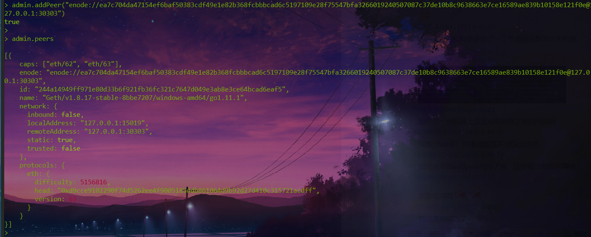

## 对 getBlock 中所得区块的各个字段进行解释
```python
> eth.getBlock(1)
{
  difficulty: 131072,
  extraData: "0xda83010811846765746888676f312e31312e318777696e646f7773",
  gasLimit: 4290772993,
  gasUsed: 0,
  hash: "0x38df594d91089d7031edede1a2988a9f094a82e659517614ddbf0e90b59f05c9",
  logsBloom: "0x00000000000000000000000000000000000000000000000000000000000000000000000000000000000000000000000000000000000000000000000000000000000000000000000000000000000000000000000000000000000000000000000000000000000000000000000000000000000000000000000000000000000000000000000000000000000000000000000000000000000000000000000000000000000000000000000000000000000000000000000000000000000000000000000000000000000000000000000000000000000000000000000000000000000000000000000000000000000000000000000000000000000000000000000000000000",
  miner: "0x8465a86a118ab32b8b8615085bff4e8ada1e649d",
  mixHash: "0x1e139b87e253dde990d9cc4f32f8d65373be51805a9495091796760eff6935b3",
  nonce: "0x6684d8d8f2a23a35",
  number: 1,
  parentHash: "0x40ddc7b90156718ba816545b3547f03508604f73b0d68bd99d06a596fdd357d6",
  receiptsRoot: "0x56e81f171bcc55a6ff8345e692c0f86e5b48e01b996cadc001622fb5e363b421",
  sha3Uncles: "0x1dcc4de8dec75d7aab85b567b6ccd41ad312451b948a7413f0a142fd40d49347",
  size: 539,
  stateRoot: "0xd7bccdfa3412e9f57415fc1806e365c87fecc1a9818826029a62cf28c701df10",
  timestamp: 1541146364,
  totalDifficulty: 131073,
  transactions: [],
  transactionsRoot: "0x56e81f171bcc55a6ff8345e692c0f86e5b48e01b996cadc001622fb5e363b421",
  uncles: []
}
```
**Difficulty**: 当前块的难度值
**extraData:** 区块附加数据，<=32字节 
**gasLimit:**  本区块最多使用的gas限制
**gasUsed:** 本区块交易消耗的总gas
**hash**: 当前块的哈希值
**logsBloom:** 区块日志的Bloom过滤器，供查询区块的信息 
**miner**:成功挖出本区块的矿工地址，用于接收矿工费 
**mixHash**:256位的hash，与nonce组合证明出块执行了足够的计算
**nonce**:64位的hash，与MixDigest组合证明出块执行了足够的计算 
**number**:  区块号，直系父节点的个数 
**parentHash**: 上一区块全部内容的hash 
**receiptsRoot**:本区块所有交易的收据的tree的根hash
**sha3Uncles**:本区块的所有叔伯块的hash
**size**:区块大小，单位是字节
**stateRoot**:本区块所有交易的状态tree的根
**timestamp**: 本区块创建时的Unix时间戳 
**totalDifficulty**:截至到当前块的区块链的总难度 
**transactions**:交易对象的数组
**transactionsRoot**: 本区块所有交易tree的根hash 
**uncles**:叔伯块的数组

## 对日志输出进行解释
初始化信息
```python
INFO [11-02|19:46:16.119] Maximum peer count                       ETH=25 LES=0 total=25
解释：最大的peer数  ETH:That's the number of peers running normal, non-light clients.  LES:The number running light clients.
INFO [11-02|19:46:16.666] Initialising Ethereum protocol           versions="[63 62]" network=15
解释：versions:以太坊协议，62 for PV62,63 for PV63. network:网络ID
[https://github.com/ethereum/wiki/wiki/Ethereum-Wire-Protocol]
INFO [11-02|17:09:40.148] Mapped network port                      proto=udp extport=30303 intport=30303 interface=NAT-PMP(192.168.1.1)
解释：proto:网络使用的协议 extport：出口 intport：入口 interface：接口

```
```python
INFO [11-02|19:46:16.689] Rewound blockchain to past state         number=39  hash=d9cce9…1acdff
INFO [11-02|19:46:16.700] Loaded most recent local header          number=105 hash=a7a731…cbcfa4 td=13945410 age=4m39s
介绍：加载区块头 number:区块号 hash:区块hash值 
INFO [11-02|19:46:16.715] Loaded most recent local full block      number=39  hash=d9cce9…1acdff td=5156816  age=3h21m14s
解释：加载本地最新的全量的区块
INFO [11-02|19:46:16.729] Loaded most recent local fast block      number=105 hash=a7a731…cbcfa4 td=13945410 age=4m39s
解释：加载本地最新的快速同步区块 td:TotalDifficulty
INFO [11-02|19:46:16.745] Loaded local transaction journal         transactions=0 dropped=0
解释：加载本地的交易日志 transactions：交易数 dropped:丢弃交易数 
INFO [11-02|19:46:16.757] Regenerated local transaction journal    transactions=0 accounts=0
解释：重新生成本地的交易日志 accounts：账户数
```

挖矿信息：
```python
INFO [11-02|19:41:35.638] 🔗 block reached canonical chain          number=96  hash=9098c9…7153db
解释：表示将该块加到主链上
INFO [11-02|19:41:35.638] 🔨 mined potential block                  number=103 hash=9587e7…7330ba
解释：表示挖到区块，number:块号 hash:挖到的区块的哈希值
DEBUG[11-02|19:41:35.638] Reinjecting stale transactions           count=0
INFO [11-02|19:41:35.638] Commit new mining work                   number=104 sealhash=c4f1e1…37d791 uncles=0 txs=0 gas=0 fees=0 elapsed=0s
解释：提交一个新的挖矿任务 number:即将要挖的区块号 
DEBUG[11-02|19:41:36.156] Trie cache stats after commit            misses=0 unloads=0
解释：在提交任务后Trie cache的统计信息
INFO [11-02|19:41:36.156] Successfully sealed new block            number=104 sealhash=c4f1e1…37d791 hash=812de4…7f329d elapsed=518.598ms
解释：计算完毕，完成了一个新块
```
```python
DEBUG[11-02|17:37:43.266] FS scan times                            list=0s        set=0s       diff=0s
解释：快速同步扫描次数
DEBUG[11-02|17:38:00.149] Recalculated downloader QoS values       rtt=20s confidence=1.000 ttl=1m0s
解释：重新计算服务质量值  rtt:同一个封包来回时间 ttl：存活时间
DEBUG[11-02|17:38:08.431] Adding p2p peer                          name=Geth/v1.8.11-stable/...                             addr=52.16.188.185:30303 peers=1
解释：添加节点
DEBUG[11-02|17:38:08.431] Ethereum peer connected                  id=930cf49cd4de09a6 conn=dyndial    name=Geth/v1.8.11-stable/linux-amd64/go1.10
解释：连接 peer,id: peer id
DEBUG[11-02|19:41:27.029] Trie cache stats after commit            misses=0 unloads=0
INFO [11-02|19:41:36.534] Mining too far in the future             wait=2s
解释：保证我们的时间不要超过本地当前的时间太远， wait：等待的时间,即Sleep
DEBUG[11-02|19:41:25.917] IP exceeds bucket limit                  ip=159.69.2.230
解释：IP数超过限制 ip:准备添加的ip
DEBUG[11-02|19:41:26.622] Revalidated node                         b=10 id=26e9cebb2d38c1de
解释：重新验证节点
```


## 编写简单的智能合约，在 remix 下进行调试，并部署在链上进行调用
### 编写智能合约
```js
pragma solidity ^0.4.4;

contract Counter{
    uint public count = 10;
    function inc(uint num) public returns (uint){
        return count+=num;
    }
}

contract CallCounter{
    uint public count = 20;
    function callByAddr(address addr) public returns (uint){
        return Counter(addr).inc(2);
    }
    
}
```
### remix 调试
在 remix 右侧点击 run,先选择 Counter,点击 create,部署合约，然后 选择 callCounter 进行 create
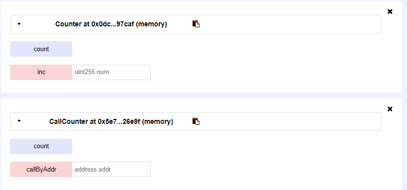
可以在命令行终端看到详细的回执信息
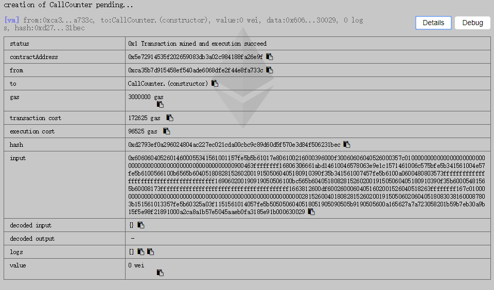
在命令行中找到Counter 合约的地址：
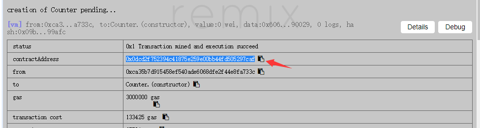
作为 callCounter 中的函数参数进行调用：
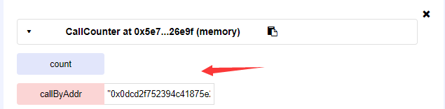
在命令行输出可以看到该条交易的信息
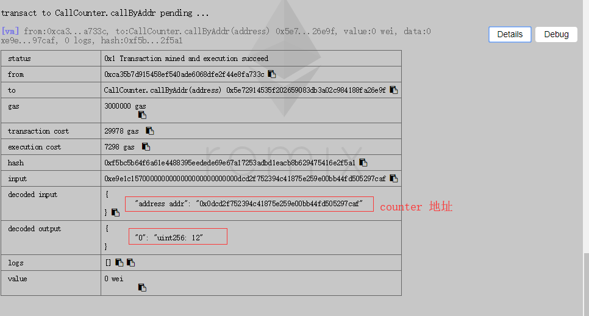
点击交易右边的debug 切换到 debugger 面板，就可以对这个交易进行调试。
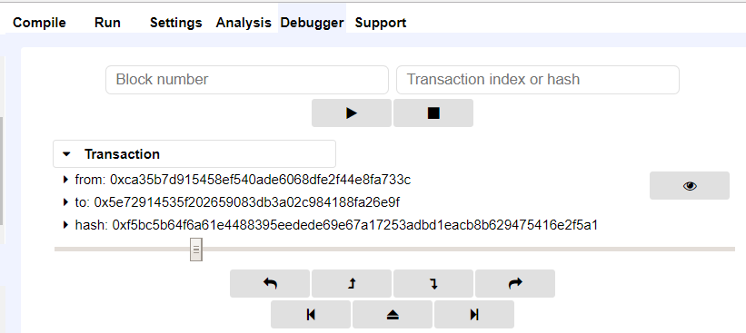

### 部署合约到私链上
部署合约就是将编译好的合约字节码通过外部账号发送交易的形式部署到以太坊区块链上。
这里我将Counter部署到自己搭的私链上。
在 remix 获取智能合约字节码和abi
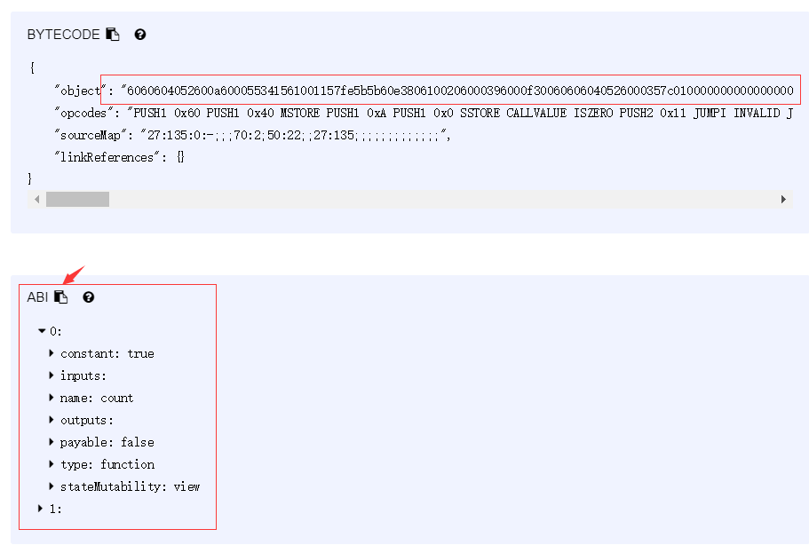
在bejson中将abi转义成字符串
通过abi创建合约对象
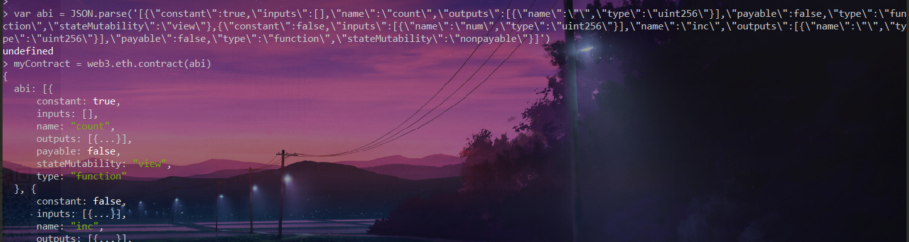
预估手续费
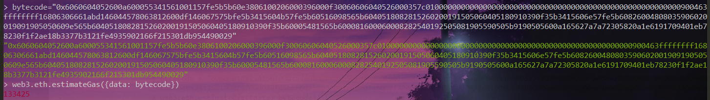
部署合约
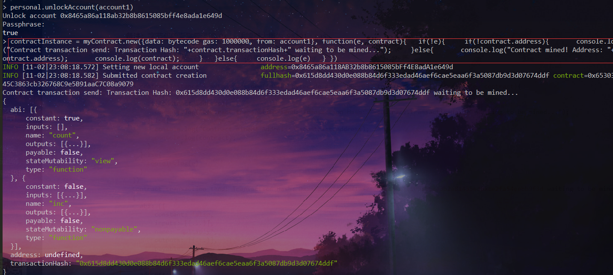
之后启动挖矿处理该交易
验证合约是否成功部署
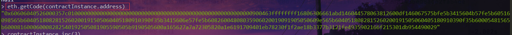
调用合约：
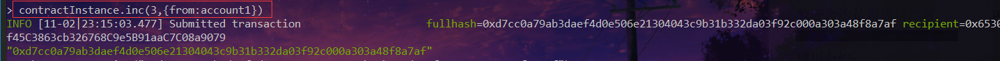
根据输出的Hash值可以查询到该交易，此时交易为pending状态，需要启动挖矿处理
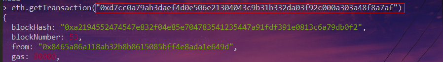

注意，在这个过程中需要保证当前账户有足够的余额并且对账户进行解锁。

## 对交易的字段进行解释
```python
> eth.getTransaction("0xd7cc0a79ab3daef4d0e506e21304043c9b31b332da03f92c000a303a48f8a7af")
{
  blockHash: "0xa2194552474547e832f04e85e704783541235447a91fdf391e0813c6a79db0f2",
  blockNumber: 53,
  from: "0x8465a86a118ab32b8b8615085bff4e8ada1e649d",
  gas: 90000,
  gasPrice: 1000000000,
  hash: "0xd7cc0a79ab3daef4d0e506e21304043c9b31b332da03f92c000a303a48f8a7af",
  input: "0x812600df0000000000000000000000000000000000000000000000000000000000000003",
  nonce: 2,
  r: "0xfe0480c0b686eafd215c2831d6b3b23e2e6f2047d65c7cdfa067955f7ddfa200",
  s: "0x1875b2a30b2811b410149fa66f083afd418bfbdeccd8101a0e4d6649cb090ac1",
  to: "0x65303f45c3863cb326768c9e5b91aac7c08a9079",
  transactionIndex: 0,
  v: "0x6095",
  value: 0
}
```
**blockHash**：交易所在块的哈希值。如果交易处于pending状态，则该值为null
**blockNumber**： 交易所在块的编号
**from**: 交易发送方的地址
**to**: 交易接收方的地址，对于创建合约的交易，该值为null
**hash**：交易的哈希值
**gas**: 发送者提供给矿工的gas
**gasPrice**:表示发送者愿意支付给矿工的Gas价格； 
**input**:存在的数据字段，如果存在，则是表明该交易是一个创建或者调 用智能合约交易； 
**nonce:** 用来区别同一用户发出的不同交易的标记； 
**to**: 交易接收者的地址； 
**value**:发送者要转移给接收者的以太币数量； 
**r、s、v**：交易签名的三个部分，由发送者的私钥对交易hash进行签名生成。


## 参考链接：
- https://blog.csdn.net/ShuSheng0007/article/details/79391105
- https://web3js.readthedocs.io/en/1.0/web3-eth.html#id42
- http://liyuechun.org/2017/10/14/eth-private-blockchain/
[Ethereum Wire Protocol](https://github.com/ethereum/wiki/wiki/Ethereum-Wire-Protocol)
