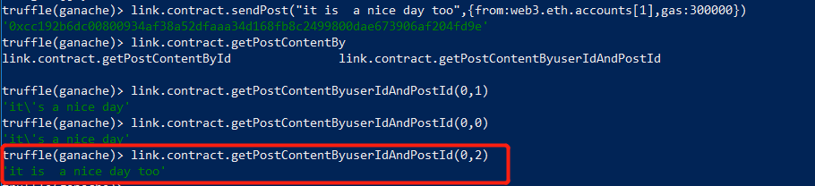

### 部署环境
`ganache v1.2.2`
`truffle v4.1.14`
`node v8.4.0`

### 接口设计
本次的选题是基于区块链的社交网络。提供用户分享动态，沟通的平台
本次部署使用了 `truffle` 框架+ `ganache` 
首先  `truffle init` 新建项目，编写智能合约，放在 `contracts` 目录。
首先合约定义了三个结构体，分别为用户，评论，文章
```js
  struct Post{
    uint postId;
    uint timestamp; //时间戳
    string content; //文章内容
    address sender; //作者
    uint likeNumber;//点赞数
    mapping(uint=>address) likeAddress;//点赞的用户地址
    mapping (uint=>Comment) comments;
    uint commentSize;
  }
  struct Comment{ //评论
    uint commentId;
    uint postId;
    uint timestamp;  //时间戳
    address sender; //发送者
    string content;    //内容
  }

  struct User{
    address addr; //用户地址
    string name; //用户姓名
    uint postNumber; //文章数目
    mapping(uint=>Post)userPosts;
    uint balance;
  }
```
提供的主要接口有：
**注册用户** register 
接受一个字符串姓名，同时调用时需要设置 from 地址
```js
 function register(string _name) public{
   ...
    User memory tmpUser = User({addr:msg.sender,name:_name,postNumber:0,balance:100});
    users.push(tmpUser); 
  }
```
**更改名字**  setName 输入新的名字，设置 `from` 地址，则可以修改该地址对应的账户名
```js
function setName(string _name) public{
    for (uint i = 0; i < users.length; i++) {
      if(users[i].addr == msg.sender)
        users[i].name = _name;
    } 
  }
```
**发表文章** sendPost，即动态，输入文章内容(string)，长度不能超过200字符，指明 from 地址，则可以发表动态。系统会记录发表文章的事件，作者，点赞数，评论。
```js
function sendPost(string _content) public {
require(bytes(_content).length <= 200,"content is too long"); //动态长度限制
for(uint p = 0; p < users.length; p++){
  if(users[p].addr == msg.sender){
    Post memory postTmp = Post({
      postId: getPostID(),
      timestamp: now,
      content:_content,
      sender:msg.sender,
      likeNumber: 0,
      commentSize:0
      }
    );
    users[p].userPosts[users[p].postNumber] = postTmp;
    users[p].postNumber++;
    posts.push(postTmp);
  }
}
}
```
**根据名称获取用户地址**
输入账户名称(string)，获取账户的地址
```js
 function getNameOfAddress(string name) public view returns (address addr) {
    addr = 0;
    for (uint i = 0; i < users.length; i++) {
      if(StringUtils.equal(users[i].name,name))
        addr = users[i].addr;
    }
}
```

**根据地址获取账户名称** 
输入账户地址，获取账户名称(string)
```js
function getAddressOfName(address addr) public view returns(string name){
    name = "";
    for (uint i = 0; i < users.length; i++) {
      if(users[i].addr==addr)
        name = users[i].name;
    }
  }
```
**获取所有的账户数目** 
```js
 function getNumberOfAccounts() public view returns (uint count) {
    count = users.length;
}
```
直接调用即可得到当前的用户数目 
**根据文章 id 查询文章内容**
输入文章 id(uint),得到该文章的内容(string)
```js
function getPostContentById(uint postId) public view returns (string content){
  content = posts[postId].content;
}
```
**评论文章** `commentPost`
需要指明交易的 from 地址
```js
 function commentPost(string content,uint postId) public {  
    Comment memory commentTmp = Comment(getCommentID(),postId,now,msg.sender,content);
    posts[postId].comments[posts[postId].commentSize] = commentTmp;    
    posts[postId].commentSize++;
    AllComments.push(commentTmp);
  }
```

**点赞文章**
```js
function likePost(uint postId) public {
  posts[postId].likeAddress[posts[postId].likeNumber]=msg.sender; 
  ++posts[postId].likeNumber; //增加点赞数
}
```
输入文章的id,指明交易的 `from` 地址.即可对文章进行点赞。

**根据用户id,文章发表顺序查询文章内容**
```js
function getPostContentByuserIdAndPostId(uint userId,uint postId) public view returns (string content){
  content = users[userId].userPosts[postId].content;
}
```
输入用户 id,评论在该用户 id 的次序，即可查询指定用户的某一篇文章内容
**获取评论内容** :根据评论 id 获取评论内容
```js
function getCommentByCommentId(uint id) public view returns (string){
  return AllComments[id].content;
}
```

**获取文章的评论数目和点赞数目**
```js
function getCommentAndLikeNumberByPostId(uint postId) public view returns(uint commentSize,uint likeSize) {
  commentSize = posts[postId].commentSize;
  likeSize = posts[postId].likeNumber;
}
```
接口会随着开发过程中逐步完善

### 调用情况
编写部署脚本
```js
var link = artifacts.require("link");
var string = artifacts.require("StringUtils");

async function doDeploy(deployer, netowrk) {
  await deployer.deploy(string);
  await deployer.link(string, link);
  await deployer.deploy(link, {
    gas: 4500000
  });

}
module.exports = (deployer, network) => {
  deployer.then(async() => {
    await doDeploy(deployer, network);
  });
};
```
在  `truffle.js`  中配置网络环境
```json
 networks: {
    ganache: {
      host: "127.0.0.1",
      port: 7545,
      network_id: "*", // Match any network id
      gas: 6721975
    }
  }
```

`truffle complie `编译合约
运行私链，这里使用的是 `ganache`,地址是 `127.0.0.1:7545`
`truffle migrate` 部署合约，如果不是第一次部署，需要加上 `--reset`
部署成功的话会在控制台输出合约地址，在 `ganache` 也可以看到部署成功的交易
合约成功部署在链上，可以看到相关的交易


输入`truffle console --network ganache`打开 `truffle` 控制台，测试刚才部署的合约
首先执行：
`link.deployed().then(contract=>{link=contract})`
意思是获取实例之后将 `contract` 赋给 `metacoin` 变量，然后我们就可以用 `link` 这个实例与`contract`进行交互。
首先注册账户，传入姓名 "aaa"
```python
truffle(ganache)> link.contract.register("aaa",{from:web3.eth.accounts[1],gas:300000})
'0x7f54899353f87db0655efd2a02eb0cbad133e80006eb341224fd62603dbcc3a1'
```
交易成功，可以在`ganache`查看到


根据地址查询得到用户名：


再次注册新账号，查询账户数量，发现变为 2
`link.getNumberOfAccounts()`


根据地址查询账号名称
`link.getAddressOfName(web3.eth.accounts[0])`


修改账户姓名：
`link.contract.setName("changename",{from:web3.eth.accounts[1],gas:300000})`


查询用户资料
`link.contract.users(0)`

可以看到地址，名称，动态数，余额。
发表文章：
`link.contract.sendPost("it's a nice day",{from:web3.eth.accounts[1],gas:300000})`


查询文章
根据文章 `id` 获取文章内容


根据 用户 `id` 和该用户发表文章的顺序获取文章内容
`link.contract.getPostContentByuserIdAndPostId(0,2)`



评论文章
` link.contract.commentPost("i agree with you",0,{from:web3.eth.accounts[0]})`

查看评论信息


查看文章信息


查询文章的评论数和点赞数
第一个数代表评论数，第二个代表点赞数


点赞文章
`link.contract.likePost(0,{from:web3.eth.accounts[1]})`


此时获取到的点赞数为 3


以上交易的相关信息，挖矿信息都可以在 `ganache` 中查看到：


**遇到的问题及解决方法**
1. `link contains unresolved libraries. You must deploy and link the following libraries before you can deploy a new version of link: StringUtils:`
在 `deploy contract` 中部署 `stringUtils`,同时还要进行 `link`
函数说明：
`deployer.link(LIBRARY, DESTINATIONS)`
把一个已部署好的库链接到一个或多个合约里. `destinations` 可以传入一个合约，也可以传入一组合约. 如果 destinations中的某个合约不依赖这个库, 那 `deployer` 的 `link`函数就会忽略这个合约。


2. `Error: VM Exception while processing transaction: out of gas`
在 `ganache` 也可以看到错误输出：
```python
[上午10:42:50]   Transaction: 0x851117a5c63b05acc00e89695028cd6bf139cda0e7752a3521e489755dd4dfd6
[上午10:42:50]   Gas usage: 90000
[上午10:42:50]   Block Number: 33
[上午10:42:50]   Block Time: Mon Nov 26 2018 10:42:50 GMT+0800 (中国标准时间)
[上午10:42:50]   Runtime Error: out of gas
```
在部署的时候添加 `gas` 参数，进行交易时：
`link.contract.register("aaa",{from:web3.eth.accounts[1],gas:300000})`

3. 部署的时候出现问题：`Error: Exceeds block gas limit`
解决方法：
```python
truffle(ganache)> web3.eth.getBlock("pending").gasLimit
6721975
```
在` truffle.js `中设置 gas 为 `6721975`

4. `Error: base fee exceeds gas limit`
https://ethereum.stackexchange.com/questions/12848/error-base-fee-exceeds-gas-limit-when-creating-new-contract-instance-using-t

5. 在 `remix` 上进行编译时，发现编译器版本不匹配，出现了很多问题：
`Expected token Semicolon got Lparen`
出错语句：` emit  CoinTransfer(msg.sender, receiver, amount);`
https://ethereum.stackexchange.com/questions/51124/parsererror-expected-token-semicolon-got-lparen
编译器版本问题，这里不支持 `emit`
6. `require,revert `参数问题，不同编译器版本也不一样
此外还有还有遇到很多关于 memory 和 stroage 的问题，尝试了很多都没有解决，最后结构体里面的变长数组都换成了 `mapping+counter` 的形式。
